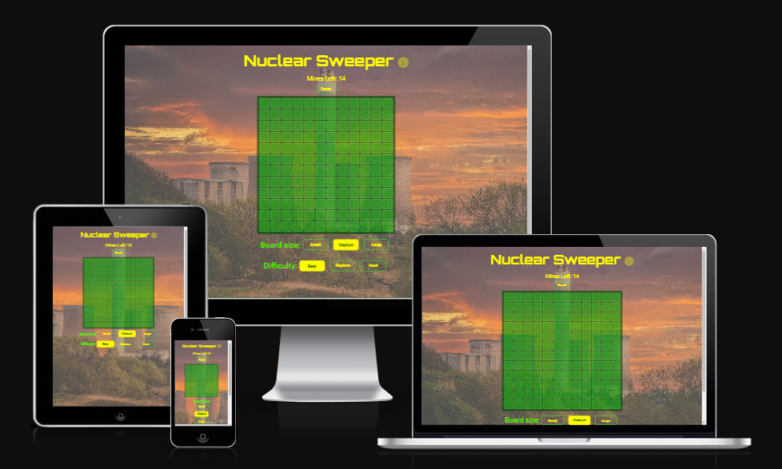
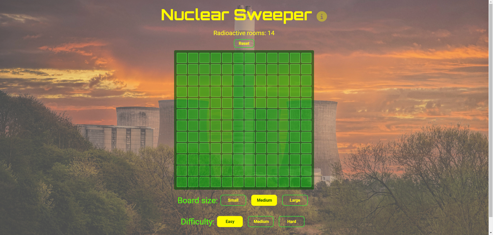
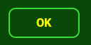
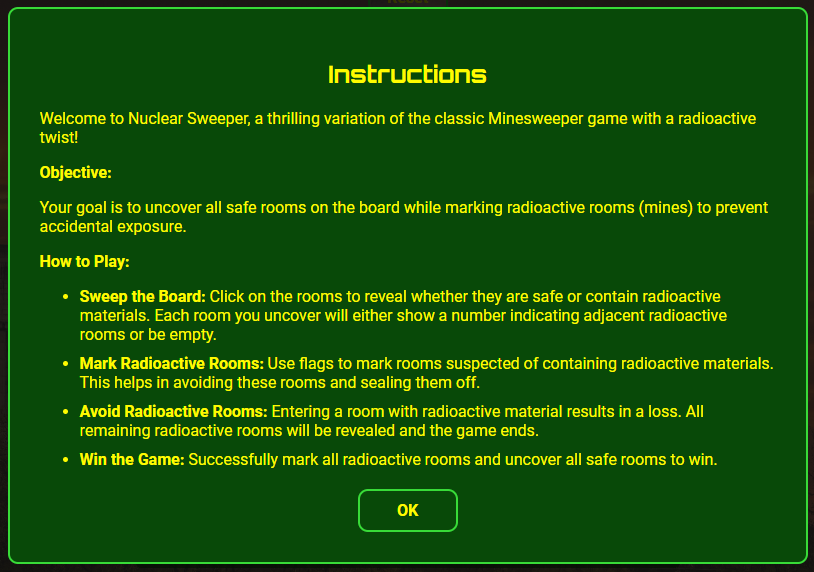
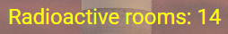
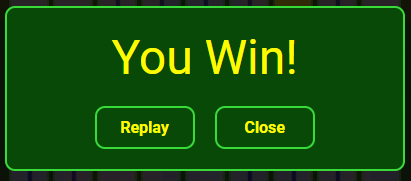
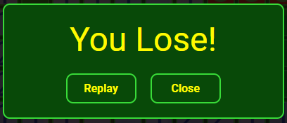
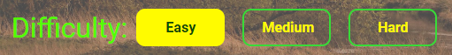

# Nuclear Sweeper

## Introduction

Welcome to Nuclear Sweeper, an exhilarating variation of the classic Minesweeper game with a radioactive twist! In this game, your objective is to uncover all safe rooms on the board while marking radioactive rooms (mines) to prevent accidental exposure. Sweep the board by clicking on rooms to reveal their safety status, use flags to mark suspected radioactive rooms, and avoid uncovering any radioactive material to stay safe. Adjust the board size and challenge yourself with different difficulty levels to enhance your gameplay experience. Dive into Nuclear Sweeper and test your strategic skills in this high-stakes environment!

You can access the game [here](https://sasantazayoni.github.io/Minesweeper/).

## Colour scheme

The chosen colors for Nuclear Sweeper are particularly well-suited for a radioactive/toxic theme, enhancing the overall aesthetic and user experience. Here's why each color fits this theme effectively:

1. rgb(81, 255, 0) - Light Green (Game Tiles):

  * Radioactive Glow: This bright, almost neon green evokes the classic imagery of radioactive materials, which often glow in a similar shade. It creates an immediate association with radiation and toxicity.
  * Visibility: The high luminosity of this green makes it highly visible, ensuring that game tiles are easily distinguishable from other elements.

2. rgb(255, 251, 0) - Yellow (Text/Buttons):

  * Hazard Warning: Yellow is universally associated with caution and hazards. Using it for text and buttons emphasizes the danger and urgency inherent in the game.
  * Attention-Grabbing: Its brightness ensures that essential game elements like text and buttons are instantly noticeable, guiding players effectively.

3. rgb(8, 73, 8) - Dark Green (Backgrounds such as Footer and Game Border):

  * Contrasting Backdrop: This dark green provides a strong contrast against the lighter, more vibrant colors, making game elements stand out.
  * Toxic Environment: Dark green can suggest a murky, hazardous environment, fitting the theme of a toxic, contaminated area.

4. rgb(188, 188, 255) - Light Blue (Clean Rooms):

  * Safe Zone: Light blue provides a calming contrast to the more intense colors, indicating safe, non-radioactive rooms.
  * Clarity and Relief: This color offers visual relief and clarity, helping players quickly identify safe areas amidst the toxic theme.

5. rgb(0, 0, 0) - Black (Text and UI Components):

  * Stark Contrast: Black offers the highest contrast, ensuring text and key UI components are readable against any background color.
  * Mystery and Depth: It adds an element of mystery and seriousness, enhancing the game's overall atmosphere.

## Typography

Using 'Orbitron' for headings and 'Roboto' for body text is ideal for Nuclear Sweeper due to their complementary characteristics:

### 'Orbitron' for Headings

* Futuristic Look: Its sleek, geometric design fits the game's radioactive/toxic theme.
* Attention-Grabbing: Bold and distinctive, it highlights key information effectively.
* Unique Personality: Adds a memorable, high-tech vibe to the game.

### 'Roboto' for Body Text

* Readability: Clear and easy to read, even at smaller sizes.
* Modern and Neutral: Complements 'Orbitron' without visual conflict.
* Versatility: Maintains clarity across different devices and screen sizes.

### Combined Benefits

* Contrast and Hierarchy: Clear visual hierarchy enhances navigation.
* Consistent Style: Modern aesthetic creates a cohesive look.
* Engagement: Striking headings and readable body text keep players focused and engaged.

In essence, 'Orbitron' and 'Roboto' together enhance both the visual appeal and readability, fitting perfectly with Nuclear Sweeper's theme and ensuring an engaging user experience.

## Features

* The app consists of a main page with the game board and a footer. The github link has a glow-effect when hovered upon.

* All buttons have a transparent background with a yellow border and yellow text. The text becomes dark green when the button is hovered and the button displays a yellow glow-effect.

* There is an information icon which behaves as a button. This opens a modal to show the game instructions.

* There is an indicator above the board with text "Radioactive rooms" indicating the number of rooms that are a hazard (i.e. lose the game). This decreases every time a tile is flagged and increases again when the flag is removed.

* There is a "Reset" Button to reset the game.

* The main game board initially consists of hidden tiles.

* When a room is "clean", it will appear as a blue tile or a numbered blue tile. The number represents the number of adjacent radioactive rooms. Winning the game can be achieved by flipping all these tiles.

* Rooms can be flagged to indicate a dangerous room in order to avoid.

* Entering a radioactive room will show a radioactive symbol nd this will lose the game.

* Winning or losing a game opens a modal which gives the user an option to reset the game or to check out the board again.

* The board size can be adjusted to be small (9x9), medium (12x12) or large (15x15).

* The difficulty of the game can be adjusted - Easy, Medium or Hard which have 10%, 20% and 30% hazardous tiles respectively.

